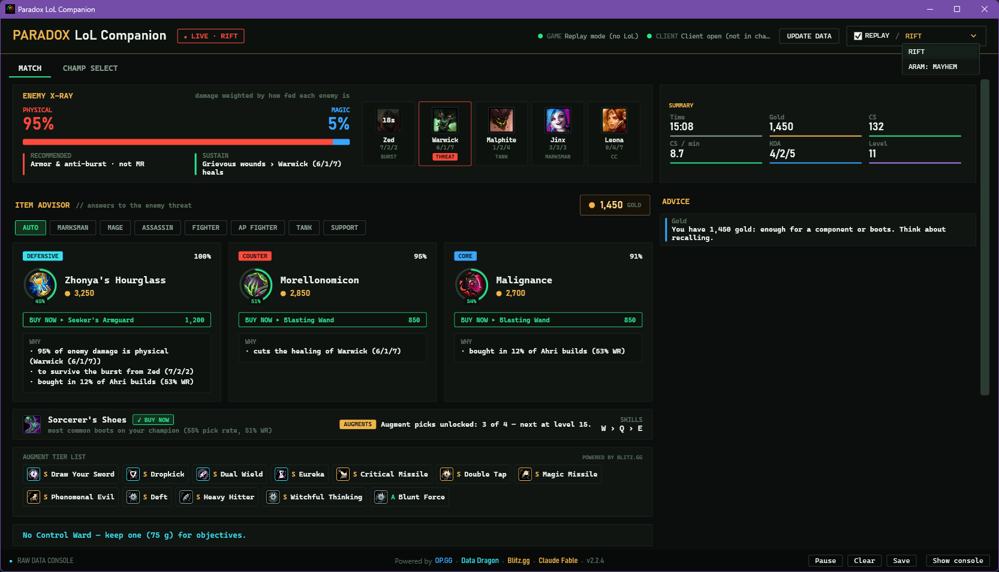
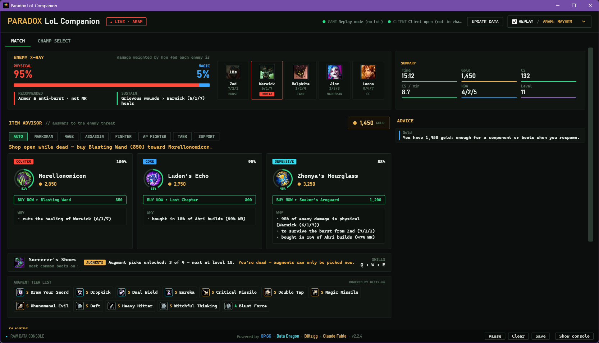
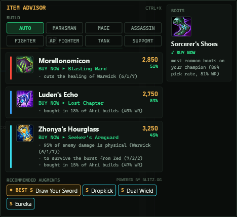
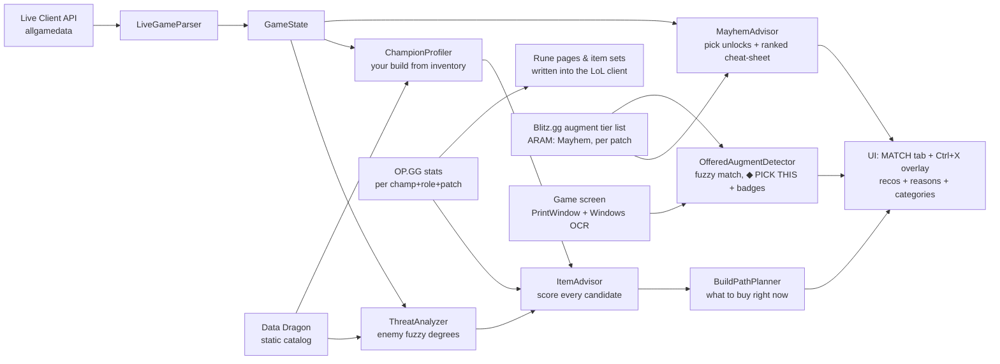

# Paradox LoL Companion

A Windows desktop companion for **League of Legends** (C# / .NET 10 / WPF) that reads the
game's **local APIs live** and turns them into actionable, explained advice — with a full
**item advisor** as its core: every recommendation tells you *why*, reacting in real time
to how fed each enemy is, what they're building, and what you're actually building.

No injection, no reading game memory: everything comes from the two official local HTTP
APIs that Riot ships with the game, plus public static data. It's a second screen, not a
mod — and the optional in-game overlay (Ctrl+X) is a plain always-on-top window drawn by
Windows, never injected into the game.

> **Download:** grab the installer from
> [**Releases**](https://github.com/Danielxpj/Paradox-LoL-Companion/releases) →
> `ParadoxLoLCompanion-Setup-<version>.exe`. Installs per-user (no admin) and
> **auto-updates itself** on launch.



**ARAM: Mayhem** — augment pick tracker, Blitz tier cheat-sheet (★ = ranked top for your
champion) and the pick-now window while you're dead:



**In-game overlay (Ctrl+X)** — top item recommendations with their reasons and buy-now
plans, build override, recommended boots, and the recommended augments during a Mayhem
pick window:



---

## Table of contents

- [What it does](#what-it-does)
- [Where the data comes from](#where-the-data-comes-from)
- [Architecture](#architecture)
- [The algorithms](#the-algorithms)
  - [1. Fuzzy logic core](#1-fuzzy-logic-core)
  - [2. Threat analysis — the enemy X-ray](#2-threat-analysis--the-enemy-x-ray)
  - [3. Champion profiling & build detection from your inventory](#3-champion-profiling--build-detection-from-your-inventory)
  - [4. Item scoring](#4-item-scoring)
  - [5. Statistical prior (OP.GG)](#5-statistical-prior-opgg)
  - [6. Purchase planner](#6-purchase-planner)
  - [7. Boots, sells, starters and late-game tips](#7-boots-sells-starters-and-late-game-tips)
  - [8. ARAM bench advisor](#8-aram-bench-advisor)
  - [9. ARAM: Mayhem augment tracker](#9-aram-mayhem-augment-tracker)
- [Writing back to the client: rune pages & item sets](#writing-back-to-the-client-rune-pages--item-sets)
- [Auto-update](#auto-update)
- [Configuration](#configuration)
- [Building from source](#building-from-source)
- [Limitations & honesty notes](#limitations--honesty-notes)

---

## What it does

- **Live dashboard** — gold, CS, CS/min, KDA, level, game clock, full player table with
  champion portraits and item icons (Data Dragon CDN), and a live event feed.
- **Enemy X-ray** — a per-enemy threat panel: physical/magic damage split **weighted by
  how fed each enemy actually is** (not just the draft), sustain/healing, resistances
  they've purchased (summing the real stats of their items), crit stacking, hard engage,
  burst assassins, suppression, heavy CC, shields — with a respawn overlay while they're dead.
- **Item advisor** — top recommendations with human-readable reasons ("cuts the healing of
  Warwick (6/1/7)", "enemies already bought 160 armor", "to survive the burst from Zed"),
  each with a category badge (**Core / Counter / Defense / Spike**), a priority
  percentage, a radial gold gauge, and a **buy-now plan** (which component to buy with the
  gold you have *right now*).
- **Build-aware, both ways** — it detects *your* build from your actual inventory (tank
  Garen ≠ damage Garen) and reacts to *their* builds (anti-crit when they stack crit,
  penetration when they stack resists, lifesteal devalued when they already bought
  Grievous Wounds against you).
- **Meta stats built in** — pick/win rates per champion & role (via OP.GG's public MCP
  endpoint) reinforce recommendations, pick your boots when nothing else decides, suggest
  the standard rune page (one click writes it into the client) and **auto-write up to 3
  item-set pages** into the shop, named `Paradox: <champ> #N`.
- **ARAM-aware** — ARAM item pool, earlier anti-heal (constant fights), affordability
  boost tuned for buy-on-respawn economy, opening-buy suggestion, and a "shop open while
  dead" alert (the only moment ARAM lets you buy).
- **ARAM: Mayhem** — detected via LCU queue id 2400; tracks augment pick unlocks (start +
  levels 7/11/15, only redeemable while dead) and gives archetype/threat-tuned guidance.
  Plus: a **Blitz.gg tier-list cheat-sheet** (S/A augments per rarity, ★ for your champion,
  cached per patch) and **on-screen offer detection** — while you pick, the app OCRs the
  game window, recognizes the augments offered, marks the best one (**◆ PICK THIS**) and
  pins a **tier badge directly over each card** via a click-through topmost window. Once
  you pick, everything clears itself within ~3 seconds.
- **In-game overlay (Ctrl+X)** — a compact, draggable always-on-top panel with the top
  item recommendations (reasons included), the build override selector, the recommended
  boots, and the offered/recommended augments during a Mayhem pick window. Requires
  Borderless/Windowed (in exclusive Fullscreen, Windows draws no windows over the game).
- **Champ select bench advisor (ARAM)** — scores your team composition and tells you which
  bench champion balances the team best, with reasons.
- **Quality-of-life advice no app gives** — full-inventory handling (flags items you have
  no slot for, and knows when buying *frees* a slot by merging owned components), sell
  suggestions for items that no longer fit your build, elixir reminder on a full build,
  Control Ward reminder on the Rift.
- **Replay mode** — a recorded snapshot (Rift or ARAM: Mayhem scenario) lets you explore
  the whole app with LoL closed.

All item and champion names are shown in **English** (Data Dragon `en_US`) regardless of
your client language — players are matched via locale-independent ids.

## Where the data comes from

| Source | What | How |
|---|---|---|
| **Live Client Data API** | Everything about the running game: players, scores, items, gold, events | `https://127.0.0.1:2999/liveclientdata/allgamedata`, polled ~1 s, no auth |
| **LCU (League Client API)** | Champ select session, bench, queue id, gameflow; also *writing* rune pages & item sets | Local HTTPS port + token parsed from the client `lockfile` |
| **Data Dragon** | Static catalog: champions (tags, `info`), items (stats, gold, tags, build tree `from`/`into`, per-map availability), icons | Downloaded once per patch, cached at `%LocalAppData%\ParadoxLoLCompanion\ddragon\<version>\<locale>` |
| **OP.GG MCP** | Per champion+role+patch: core item sets, 4th/5th/6th item candidates, boots, starters, runes, skill order — with pick rate, win rate, sample size | `https://mcp-api.op.gg/mcp` (public MCP endpoint), cached per patch |

## Architecture

Two projects with a hard boundary: **Core has no UI dependency and is fully testable**
(373 xUnit tests); the WPF app is a thin MVVM shell over it.

```
src/
  ParadoxLoLCompanion.Core/          # everything below is plain, testable C#
    Connectors/       LiveClientConnector (poll ~1s) · Lcu/ (lockfile, champ select,
                      gameflow queue, LcuRuneWriter, LcuItemSetWriter)
    Live/             LiveGameParser: allgamedata JSON -> GameState
    DataDragon/       versioned catalog: StaticChampion/StaticItem, tag canonicalization,
                      per-map item pools, CDN icon urls, local cache
    Items/            THE ENGINE: Fuzzy · ThreatAnalyzer · ChampionProfiler ·
                      ItemAdvisor · BuildPathPlanner · ArchetypeWeights
    Stats/            OpggMcpClient · McpTextParser · StatsCache · StatsProvider ·
                      ItemSetBuilder (meta stats layer)
    Draft/            TeamBalanceAdvisor (ARAM bench)
    Mayhem/           MayhemAdvisor (augment tracker + Blitz-ranked cheat-sheet) ·
                      PickWindowTracker (pick-window lifecycle: grace + OCR-driven close)
    Augments/         Blitz tier list (client/parser/cache/provider) + OCR matcher/detector
    Advice/           rule-based general advice feed (objectives, CS/min, gold)
    Objectives/       Dragon/Baron timer estimates
  ParadoxLoLCompanion.App/           # WPF, MVVM, dark "Tactical HUD" theme
    Capture/          game-window capture (PrintWindow) + Windows OCR reader
    Update/           Updater (self-update on launch) + splash
    OverlayWindow · AugmentBadgeWindow   # Ctrl+X overlay + click-through on-card badges
tests/
  ParadoxLoLCompanion.Tests/         # 373 tests: parsers, engine, planners, stats, LCU
```

Data flow, once per tick (~1 s):



---

## The algorithms

The engine deliberately avoids two extremes: hard-coded "best build" lists (they can't
react to the game) and opaque ML (it can't explain itself). Instead it's a **transparent
scoring engine over fuzzy logic**: every number below is in the source, every bonus
produces the reason string you see in the UI, and everything is tunable from a JSON
config without recompiling.

### 1. Fuzzy logic core

`Core/Items/Fuzzy.cs` — five pure functions, all returning degrees in `[0,1]`:

| Function | Meaning |
|---|---|
| `Ramp(x, foot, shoulder)` | 0 below *foot*, 1 above *shoulder*, linear between (reversed if foot > shoulder) |
| `Triangle(x, foot, peak, shoulder)` | rises to 1 at *peak*, falls after |
| `And(a, b, …)` = min | cautious conjunction |
| `Or(a, b, …)` = max | disjunction |
| `AndProduct(a, b)` = a·b | soft conjunction — a weak degree drags a strong one down |

Why it matters: v2 of the engine used hard thresholds ("if enemy armor > 100, recommend
penetration"), which made recommendations **flip on and off between ticks** as values
crossed the line. v3 replaced every threshold with a ramp whose **μ = 0.5 crossover sits
exactly where the old threshold was** — same calibrated behavior, but recommendations now
ease in and out smoothly and the top-3 is stable frame to frame.

### 2. Threat analysis — the enemy X-ray

`ThreatAnalyzer.Analyze(GameState)` produces one `TeamThreat` per tick. The key idea:
**every enemy is weighted by how fed they are**, so a 7/1 Katarina dominates the threat
picture even if the draft was 50/50 physical/magic:

```
weight(enemy) = max(0.5, 1 + 2.5·kills + 0.8·assists + 0.04·CS + 0.5·level − 1.2·deaths)
```

The floor of 0.5 keeps every enemy relevant. With those weights it computes raw facts
(weighted physical/magic damage split, summed **real armor/MR/HP from the items each
enemy owns**, who the top physical / magical / sustain / burst threat is) and then
**defuzzifies** them into 11 graded degrees ∈ [0,1] that the scorer consumes:

| Degree | Ramps from → to | Reads |
|---|---|---|
| `PhysicalSkew` / `MagicalSkew` | share 0.50 → 0.75 | damage split, fed-weighted |
| `ArmorStack` / `MrStack` | 0.4× → 2× config threshold | resistances actually purchased |
| `Sustain` | map threshold → 1.7× | healers + lifesteal items (lower foot in ARAM) |
| `Burst` | 0.75× → 1.5× threshold | strongest assassin vs. average enemy weight |
| `CritThreat` | `Or(crit bought 0.15→0.9, marksman share 0.35→0.75)` | crit already built *or* inevitable |
| `PercentHpTrue` | 15% → 50% of weighted threat | %HP / true-damage champions (config list) |
| `HardEngage` | 15% → 50% | engage champions (config list) |
| `EnemyAntiHeal` | 5% → 35% | enemies holding Grievous Wounds items |
| `EnemyTankiness` | (HP + 20·(armor+MR))/enemy: 800 → 3500 | how gold-into-durability they went |

One honesty detail: with several enemies all at equal weight (game start, everyone 0/0/0)
there is no "biggest threat" — naming one would be invented noise, so the field is
suppressed until someone actually pulls ahead.

### 3. Champion profiling & build detection from your inventory

`ChampionProfiler` answers two independent questions:

**What damage does this champion deal?** From Data Dragon's `info.attack` vs
`info.magic` (difference ≥ 3 → physical, ≤ −3 → magical, else mixed), with config
overrides for the champions where the data misleads. Damage type is a property of the
**kit** — it never changes with items.

**What build are they going?** The archetype (marksman, mage, AD/AP fighter, assassin,
tank, enchanter) starts from the champion's class tag, but for *you* it's refined by a
**gold-weighted vote over your real inventory**:

- Every non-boots, non-consumable item you own votes for the archetype whose tag-weight
  table best explains it, with voting power = the item's **total gold cost** (a finished
  item outvotes a component ~4:1).
- Votes are normalized per item (`gold · fit/bestFit`), so an item adds evidence to every
  archetype it partially fits.
- The champion's default archetype starts with a head start of `buildDetectionPriorGold`
  (default 1200 g) — you need *real* evidence to move the needle, which prevents one
  early Bami's Cinder from re-labeling a fighter as a tank.
- It's **stateless and recomputed every tick** from the inventory, so selling everything
  and pivoting to another build flips detection automatically. The UI banner announces
  it: *"Build detected from your items: tank"*. A manual override (radio row in the UI)
  always wins.

### 4. Item scoring

`ItemAdvisor.ScoreItem` — the heart. Every completed item in the current map's pool that
you don't already own gets:

```
score = core(fit) + offense + defense + statBonus − lifestealPenalty
```

**Core fit.** `fit` = sum of the archetype's weights over the item's tags (weight tables
per archetype live in config). Then:

```
core = 3 · √fit · (0.8 + 0.4 · min(goldEfficiency, 1.2))
```

The **square root compresses fit** on purpose: without it, a stat-stick with five matching
tags would drown out every situational counter, and the whole point is that a *needed*
counter must be able to win. Gold efficiency is the classic stat-value-per-gold measure
(AD 35 g, AP 21.75 g, armor 20 g, MR 18 g, HP 2.67 g…) and only modulates ±20% because
passives — often most of an item's power — aren't priced.

**Situational bonuses.** Each rule contributes `magnitude × degree`, where the degree is
the fuzzy threat level from §2 and the magnitude says how much that counter matters at
full threat. A gate of μ > 0.05 keeps sub-threshold noise from generating reasons.

| Rule | Magnitude | Fires when | Reason shown |
|---|---|---|---|
| Anti-heal (Grievous Wounds) | 2.0 (+0.5 if it also fits your build) | `Sustain`, and nobody on your team has GW yet | "cuts the healing of Warwick (6/1/7)" |
| Armor / magic penetration | 3.0 | `ArmorStack` / `MrStack` matching *your* damage type | "enemies already bought 160 armor" |
| Resistance vs. dominant damage | 2.0 × defense-factor × wallDamp | `PhysicalSkew` / `MagicalSkew` | "78% of enemy damage is physical (Zed…)" |
| Anti-burst hybrid (Zhonya / GA / Maw / Banshee) | 2.0 | `Burst` and you're squishy; the item must pair the right resistance with *your* offense | "to survive the burst from Zed" |
| Cleanse (QSS / Mercurial) | 3.0 | enemy has suppression and you're an AD carry | "cleanses the suppression from Malzahar" |
| Anti-crit (e.g. Randuin's) | 2.5 | `CritThreat` | "reduces the enemy crit damage" |
| Anti-tank (pen / on-hit) | 2.0 | `EnemyTankiness` | "cuts through the enemy's durability" |
| Survive hard engage | 1.5 | `HardEngage`, squishy, defensive + offensive match | "survives the enemy engage" |
| Shield breaker | 1.0 | enemy has shield champions, you deal physical | "shreds enemy shields" |

Two dampeners make the defense math honest:

- **`wallDamp = 1 − 0.4·PercentHpTrue`** — against Vayne/Fiora/Gwen-style %HP or true
  damage, stacking a single resistance wall pays out less, and the score says so.
- **Lifesteal devaluation** — `0.6 × EnemyAntiHeal × (item's sustain-tag weight)` is
  *subtracted*: if the enemy already bought Grievous Wounds against you, that Bloodthirster
  is worth less than its stats claim.

**Category & priority.** The score decomposition explains itself: if situational bonuses
are under 20% of the score, the item is **Core** (recommended for fit); otherwise the
dominant component labels it **Defense** or **Counter**. A Core item you can afford *right
now* upgrades to **Spike**. Priority = `score / topScore`, shown as a % match. Finally,
affordable items get a ranking boost (×1.15 on the Rift, stronger in ARAM where you buy
on respawn), only one Grievous Wounds item may appear (the effect doesn't stack), and
duplicate catalog ids are deduped by name.

**Ownership that understands upgrades.** "Already owned" walks the whole build tree: if
you hold a transformed or Masterwork item whose id differs from its base (Muramana, Ornn
upgrades), the base and all its components count as bought and are never re-recommended.
Manaless champions (via Data Dragon `partype`) skip Mana/ManaRegen items entirely — their
kit is balanced around not needing them.

### 5. Statistical prior (OP.GG)

Live-game reasoning is the engine's soul, but the meta is real information. Per
champion + role + patch, OP.GG data enters the score as an **additive prior** — a
reinforcement of fit, never a counter (so it can't masquerade as a situational reason):

```
statBonus = 2.5 · μ
μ = pickComponent × Ramp(games, 300, 2500) × (0.75 + 0.5 · Ramp(winRate, 0.48, 0.54))
```

The subtlety is that **core-set pick rates and late-item pick rates live on different
scales** — a 3-item *combo* probability (~0.05–0.35) vs a single 4th/5th/6th-item
probability (~0.1–0.5) — so they get separate treatments:

- **Core items:** `pickComponent = 0.6 + 0.4·Ramp(pick, 0.05, 0.30)` — being in the core
  set *is* the signal, so it starts from a high floor; the pick rate only grades how
  locked-in the meta is.
- **Late candidates:** `pickComponent = 0.85·Ramp(pick, 0.08, 0.40)` — options, not "the
  build".

Sample-size and win-rate ramps keep noisy low-game data from mattering. A config map
bridges item **evolutions** (OP.GG records Muramana; the shop sells Manamune) since Data
Dragon doesn't link them. The reason string is data-honest: *"bought in 31% of Ahri
builds (52% WR)"*.

### 6. Purchase planner

`BuildPathPlanner` makes every recommendation actionable. Given a target item, your
inventory (as a **multiset** — two Long Swords are two Long Swords) and current gold:

1. **Remaining cost** — recursively walk the target's `from` tree, consuming owned
   components (each inventory copy discounts only once) and adding each node's recipe
   cost. If the result ≤ gold, you can finish the item now.
2. Otherwise, **best affordable component** — the *most expensive* missing component you
   can complete with current gold, descending recursively when a direct component is
   itself unaffordable. Most-expensive-first is deliberate: it's the purchase that leaves
   the least gold sitting dead in your wallet when you die with an open shop.

The same planner powers the boots advice and the "shop open while dead" ARAM alert.

### 7. Boots, sells, starters and late-game tips

- **Boots** are a discrete decision, kept on crisp rules on purpose: Mercury's when the
  enemy has ≥ N heavy-CC champions or the damage skews magic; Steelcaps vs physical
  auto-attack comps; otherwise the most popular boots on your champion (stats), falling
  back to your archetype's standard. Always with a purchase plan (down to basic Boots if
  gold is short).
- **Sell suggestions** (max 2): finished items whose fit for *your* archetype is below
  50% of their fit for the archetype that best explains them ("mage item — doesn't fit
  your tank build") — with situational keep-guards so it never tells you to sell active
  anti-heal, cleanse, shield-break or a needed resistance. If selling funds your top
  recommendation, it says so.
- **ARAM starter** — in the opening window with an empty inventory, the best-fitting
  starter from the map's actual starter pool (Data Dragon tag `Lane`), stats-informed.
- **Late tips** — build complete + spare gold → your archetype's elixir; Rift past 8 min
  without a Control Ward in inventory → reminder. Small things every coach nags about
  and no companion app tracks.
- **Full inventory** — recommendations you literally have no slot for are flagged
  ("sell something first"), *unless* buying them merges components already occupying
  slots — the planner knows a purchase can free space.

### 8. ARAM bench advisor

`TeamBalanceAdvisor` scores a 5-champion composition:

```
score = 3·(1 − |physShare − magShare|)     ← 50/50 damage is hardest to itemize against
      + min(frontline, 1.5)                 ← tanks 1.0, fighters 0.5
      + 1.0 if marksman + 0.75 if enchanter
      + min(0.5·heavyCC, 1.5)
```

Each bench champion is evaluated *in your place*; a swap is suggested only if it improves
the team score by ≥ 0.25 (anti-noise), with generated reasons ("adds magic damage (your
team is 100% physical)", "adds a tank/frontline"). Otherwise: *"Keep X — it's the best
balance for your team."*

### 9. ARAM: Mayhem augment tracker

Riot exposes **no local API for the offered augment choices** (verified: LCU only has
picked augments post-game; the public spectator API blocks queue 2400). So the advisor
focuses on what *is* knowable: the mode is detected via the LCU gameflow queue id (2400),
and a tracker follows pick unlocks (start + levels 7/11/15) and the redemption rule
(**only while dead**), telling you when a pick is banked and flagging the window during
death — plus archetype/threat guidance ("enemy damage is 89% physical — defensive
augments against physical are high value").

On top of that, two data-driven layers (added 2026-07-17):

- **Blitz tier-list cheat-sheet** — `BlitzAugmentClient` downloads Blitz.gg's
  hand-curated ARAM Mayhem augment tier list (server-rendered HTML; needs a browser
  User-Agent or Cloudflare answers 403), `BlitzAugmentParser` extracts ~220 augments
  (rarity, tier 1–5, description, icon, **top champions per augment**) anchored on
  stable structure (never Svelte class hashes), and it's cached per patch
  (`%LOCALAPPDATA%/ParadoxLoLCompanion/augments`, 48 h refresh) like the OP.GG stats.
  The Mayhem card and the overlay then show the S/A augments per rarity, with a ★ on
  the ones Blitz ranks top **for your champion**. A sanity floor (≥ 100 parsed
  augments) protects the cache from a Blitz redesign; on any failure the advisor
  degrades to the generic guidance above.
- **On-screen offer detection (OCR)** — while the pick window is open (you're dead),
  the app captures the game window (`PrintWindow`, same Borderless/Windowed
  requirement as the overlay), runs the built-in Windows OCR
  (`Windows.Media.Ocr`) over the full frame and fuzzy-matches every recognized line
  against the augment names (Levenshtein budget for l/i/1-style OCR noise; es_MX
  aliases pulled from CommunityDragon's arena data for the Arena-shared augments —
  Mayhem-only ones match by their English names). Two or more distinct matches are
  treated as the real offer, ranked by Blitz tier, and the best is marked
  **◆ PICK THIS** in the overlay and MATCH tab — plus a **tier badge pinned over each
  card**, anchored on the OCR word bounding boxes and drawn on a click-through topmost
  window (the game receives every click). No card geometry is assumed, so any
  resolution works; in exclusive Fullscreen the capture is black and the feature
  silently stands down to the cheat-sheet. The offer's lifecycle is OCR-driven both
  ways: sighting the cards opens the panels (and keeps them alive across your respawn,
  since the picker stays open until you choose), and once you pick, a few consecutive
  empty reads close everything within ~3 seconds — with no flicker in between, panels
  and badges only redraw when the offer actually changes.

## Writing back to the client: rune pages & item sets

The only two writes the app ever performs, both through the official LCU endpoints:

- **Rune pages** — one click applies the meta rune page for your champion+role. Pages are
  namespaced (`Paradox…` prefix) and previously-written ones are replaced, never your own.
- **Item sets** — up to 3 build variants (core + each ranked 4th/5th/6th candidate) are
  composed by `ItemSetBuilder` and written as shop item-set pages named
  `Paradox: <champ> #N`, triggered from champ select (so the game loads them at start)
  with live-game fallback. The writer follows a strict *no-GET-no-PUT* rule so your own
  pages are never clobbered.

## Auto-update

On launch, before the main window (skipped under a debugger):

1. Fetch [`version.txt`](version.txt) from this repo's `main` (6 s timeout).
2. If it's newer than the running assembly version → splash + download
   `ParadoxLoLCompanion.exe` from the latest GitHub Release.
3. Hot-swap: rename the running exe to `.old` (Windows allows renaming a running
   executable), move the new one into place, relaunch, clean `.old` next start —
   with rollback if any step fails.

Everything is **fail-open**: no internet, 404, no permissions → the installed version
just starts. That's also why the installer is per-user (`%LocalAppData%\Programs`) — the
update never needs elevation.

## Configuration

`advisor-config.json` (shipped next to the app, user-editable copy at
`%LocalAppData%\ParadoxLoLCompanion\advisor-config.json`) externalizes all of the
advisor's knowledge — no recompile needed:

- Champion lists: healers, suppression, heavy CC, shields, %HP/true damage, hard engage.
- Per-champion damage-profile and archetype overrides (for where Data Dragon misleads).
- Every threshold in §2, the per-tag weight tables of each archetype (§3–4), build
  detection prior, ARAM tuning, sell threshold, elixir/ward ids, item evolution map.

## Building from source

Requirements: **.NET 10 SDK** (WindowsDesktop/WPF workload), Windows.

```powershell
dotnet build ParadoxLoLCompanion.slnx        # build
dotnet test                                  # 373 tests (parsers, engine, planners, stats)
dotnet run --project src/ParadoxLoLCompanion.App
```

Without LoL open you'll see "waiting for game" — check **Replay mode** (top right) to
drive the whole UI from a recorded snapshot. The test suite includes a smoke test against
the *real* cached Data Dragon catalog that validates the engine's assumptions about tags
and descriptions on your machine (it soft-skips if you have no cache yet).

## Limitations & honesty notes

- **Objective timers are estimates** from patch-default spawn timings (configurable) —
  the local API doesn't expose actual timers.
- **Champion classification is data-driven** (Data Dragon tags + `info`) with config
  overrides for the misleading cases; a misclassification is a config edit, not a code fix.
- The **Mayhem augment choices** offered to you are not available through any local
  API — the tracker reads them from the screen (Windows OCR) instead, best-effort:
  needs Borderless/Windowed, ≥ 2 recognized names, and degrades to the Blitz
  cheat-sheet when it can't see the cards.
- OP.GG stats are a *prior*, never a verdict: low-sample data is ramped toward zero, and
  live-game counters can always outscore the meta pick.
- Design documents for each engine iteration live in [`docs/superpowers/specs/`](docs/superpowers/specs/).
